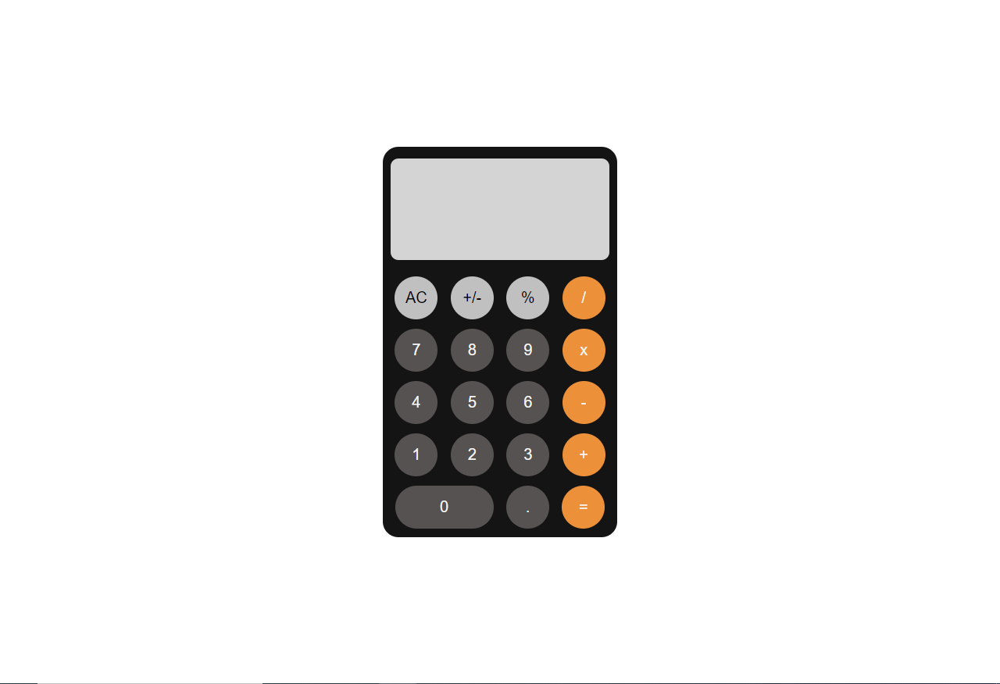

# Calculadora utilizando JavaScript 🔢

Uma calculadora básica construída utilizando HTML, CSS e JavaScript. Realiza cálculos simples como adição, subtração, multiplicação e divisão, além de porcentagem e potenciação.

## Teste o projeto 💡

Você pode testar o projeto <a src="https://dhomimonteiro.github.io/Calculator-JS/">aqui</a>.

## Licença 📄

[MIT](https://choosealicense.com/licenses/mit/)